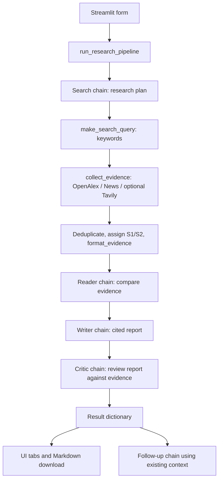

# ResearchMind: interview and dry-run guide

This guide describes the current code. Older PDF/HTML handbooks are snapshots of
an earlier implementation; start here when explaining the simplified project.

## 1. The explanation to remember

> “ResearchMind is a research assistant built with Python, LangChain, and Streamlit.
> It collects recent academic papers and news, compares the evidence, writes a
> report with source citations, and reviews the report for unsupported claims.
> Gemini handles research; Groq handles review when configured.”

Hinglish memory line: **“Question lo → sources lao → notes banao → report likho → review karo.”**

The four roles are a **sequential LLM pipeline**. Python controls their order and
calls the search APIs. There is no autonomous swarm, tool-calling agent loop,
vector database, or full-page scraper in the current workflow.

## 2. Which file does what?

| File | Responsibility | How to explain it |
| --- | --- | --- |
| `tools.py` | HTTP requests, source parsing, duplicate removal, citation IDs | “Evidence laata hai.” |
| `agents.py` | Models, role prompts, LangChain chains, follow-up answers | “Har role ko instructions deta hai.” |
| `pipeline.py` | Validation and Search → Reader → Writer → Critic orchestration | “Sab steps ko correct order mein jodta hai.” |
| `app.py` | Input form, progress, report tabs, downloads, follow-up chat | “User se input leta hai aur output dikhata hai.” |
| `dry_run.py` | Offline demonstration using the actual pipeline | “Same flow ko sample replies ke saath dikhata hai.” |
| `tests/test_project.py` | Regression checks with sample responses | “Checks that the parts still work together.” |

Read the files in this order: **tools → agents → pipeline → app**.



The Search chain produces a plan, but **the query sent to APIs comes from
`make_search_query`**, not from extracting keywords from the model's plan.
The Reader gets the plan alongside the collected sources.

## 3. Show the interviewer an executable dry run

From the project directory:

```bash
source .venv/bin/activate
python dry_run.py
```

No API keys or internet are needed for this demo. The records and model replies
are fictional, explicitly marked as samples. The demo does not measure live
provider availability or answer quality.

It still executes the real:

1. `run_research_pipeline` and all four stage builders.
2. `ChatPromptTemplate` variable substitution.
3. `collect_evidence`, `search_openalex`, and `search_news` parsing.
4. `clean_text`, `rebuild_abstract`, duplicate removal, and citation ID assignment.
5. LangChain chain invocation and `StrOutputParser`.
6. Stage progress callbacks and `export_markdown`.

Only `create_models` and HTTP GET responses are replaced temporarily. The patch
ends when the demo exits its `with` block. Running the app still uses live APIs.

### The call you can explain on the board

```python
result = run_research_pipeline(
    topic="What are the latest trends in AI in education?",
    depth="Quick scan",
    on_progress=show_progress,
)
```

| Step | Function call | Important input | Output / variable |
| --- | --- | --- | --- |
| 1 | Validate inside `run_research_pipeline` | Topic, days, depth, selected sources | Reject invalid requests before any model call |
| 2 | `create_models()` | Environment settings | `main_model`, `critic_model` |
| 3 | `build_search_agent(main_model).invoke(...)` | `request_text` | `state["search_plan"]` |
| 4 | `make_search_query(topic, "General", "Global")` | Original question | `"ai education"` |
| 5 | `collect_evidence(query, 365, 4, ...)` | Keywords, days, per-provider limit | `evidence`, `warnings` |
| 6 | `format_evidence(evidence)` | Normalized dictionaries | `sources_text` with `[S1]` and `[S2]` |
| 7 | `build_reader_agent(main_model).invoke(...)` | Request + plan + source text | `state["reader_notes"]` |
| 8 | `build_writer_chain(main_model).invoke(...)` | Request + notes + source text + language | `state["report"]` |
| 9 | `build_critic_chain(critic_model).invoke(...)` | Report + source text | `state["feedback"]` |
| 10 | `return state` | All stage outputs | One result dictionary for the UI |
| 11 | `export_markdown(result)` | Result dictionary | Downloadable Markdown string |

For Quick scan, **4 is the maximum per provider**, not the total number of
sources. The offline responses deliberately contain just one paper and one news
item, so the demo returns two sources.

### Watch the shared dictionary grow

After collecting evidence:

```python
state["search_query"] == "ai education"
state["evidence"][0]["id"] == "S1"
state["evidence"][1]["id"] == "S2"
```

A normalized source looks like:

```python
{
    "id": "S1",
    "kind": "Academic",
    "title": "DEMO: AI tutoring pilot",
    "url": "https://example.com/demo-paper",
    "published": "2026-09-01",
    "publisher": "Demo Journal",
    "authors": "Demo Author",
    "summary": "AI tutoring may support practice.",
    "cited_by": 2,
}
```

The final dictionary has these keys:

```text
request        -> question, filters, language, days, source selections
models         -> research and critic provider names
search_plan    -> Search model's plan
search_query   -> actual keywords sent to search APIs
search_results -> formatted evidence text
evidence       -> list of normalized source dictionaries
warnings       -> retrieval failure / skipped-provider messages
reader_notes   -> Reader's comparison of sources
report         -> Writer's cited report
feedback       -> Critic's review
```

`reader_notes` is the current name. The earlier `scraped_content` name was
removed because the Reader compares API abstracts/snippets, not scraped pages.

## 4. Explain the LangChain expression

```python
prompt = ChatPromptTemplate.from_messages([
    ("system", role),
    ("human", task),
])
chain = prompt | model | StrOutputParser()
answer = chain.invoke({"request": request_text})
```

- **System message:** defines the role and rules.
- **Human message:** supplies the task and placeholders, such as `{request}`.
- **`|`:** LangChain's composition operator: the previous output becomes the next input.
- **Model:** receives the formatted messages and returns a model response.
- **`StrOutputParser`:** extracts text so the rest of the project works with strings.
- **`.invoke(...)`:** executes the chain; the dictionary fills the placeholders.

Say: **“Prompt ko values milti hain, model reply deta hai, parser plain string deta hai.”**

## 5. Every application function: inputs, output, and explanation

### `tools.py`: evidence layer

| Function | Input → output | Explanation |
| --- | --- | --- |
| `clean_text(value, limit=900)` | Raw value and character limit → string | Converts missing values to empty text, removes HTML tags, decodes entities such as `&amp;`, collapses whitespace, and trims length. Example: `<p>AI &amp; science</p>` becomes `AI & science`. It cleans excerpts; it is not a full HTML sanitizer. |
| `rebuild_abstract(inverted)` | Word-to-position dictionary → abstract string | OpenAlex stores words with their positions. Build `(position, word)` pairs, sort them, then join the words. Empty input produces `""`. |
| `search_openalex(query, days, limit)` | Keywords, date window, result limit → list of Academic records | Sends an HTTP GET to OpenAlex with a date filter and relevance sorting, checks the HTTP status, reconstructs each abstract, and maps the response to the common source format. An optional `OPENALEX_API_KEY` is sent in a header. |
| `search_news(query, days, limit)` | Keywords, date window, result limit → list of News records | Sends an HTTP GET to Google News RSS, adds `when:Nd` to the query, parses XML items, and maps titles, links, dates, and descriptions to the common format. The feed uses the English/India locale; the region also influences the keyword query. |
| `search_tavily(query, days, limit)` | Keywords, date window, result limit → list of Web records | Uses the optional Tavily key for a POST request with start/end dates. Maps returned content to excerpts. Missing key returns an empty list; the collector adds a visible warning. |
| `collect_evidence(query, days, per_source, ...)` | Query, limits, source booleans → `(evidence, warnings)` | Selects providers, calls them one at a time, keeps successful results when another fails, removes duplicate URLs (or duplicate titles when URL is absent), then assigns `S1`, `S2`, etc. It copies records before adding IDs. IDs are stable within a run, not across new searches. |
| `format_evidence(records)` | Source dictionaries → prompt-friendly string | Writes each source ID, title, metadata, URL, and excerpt as a text block. If records are empty, it returns an explicit instruction to avoid factual trend claims. |

Abstract reconstruction example:

```python
rebuild_abstract({"helps": [1], "AI": [0], "learning": [2]})
# pairs: [(1, "helps"), (0, "AI"), (2, "learning")]
# sorted: [(0, "AI"), (1, "helps"), (2, "learning")]
# output: "AI helps learning"
```

`response.raise_for_status()` raises for a failed HTTP response.
`response.json()` parses JSON; `ET.fromstring(...)` parses the news XML.
`requests` timeouts prevent indefinite waits. Retrieval exceptions become
warnings in `collect_evidence`, so one unavailable provider does not discard
another provider's evidence.

### `agents.py`: model and prompt layer

| Function | Input → output | Explanation |
| --- | --- | --- |
| `create_models()` | Environment variables → `(research_model, critic_model)` | Requires a Google key, validates the output-token limit, creates Gemini, and creates Groq if its key exists. Otherwise both variables point to the same Gemini object. Provider calls have timeouts and limited retries. Constructing the clients does not itself research the topic. |
| `provider_name()` | Environment variables → provider label | Returns `Not configured`, `Gemini`, or `Gemini + Groq`. This reports configuration, not proof that the API is reachable. |
| `build_chain(model, role, task)` | Model and two prompt strings → runnable chain | The one shared implementation of `prompt | model | StrOutputParser()`. All roles use this same simple pattern. |
| `build_search_agent(model)` | Research model → Search chain | Defines planning instructions. Its `.invoke()` expects `request` and returns the plan. Python performs retrieval afterward. |
| `build_reader_agent(model)` | Research model → Reader chain | Its `.invoke()` expects `request`, `search_plan`, and `sources`. Returns comparison notes and identifies evidence gaps. |
| `build_writer_chain(model)` | Research model → Writer chain | Its `.invoke()` expects `request`, `notes`, `sources`, and `language`. Returns a report using supplied source IDs. |
| `build_critic_chain(model)` | Critic model → Critic chain | Its `.invoke()` expects `report` and `sources`. Returns a score, strengths, improvements, and verdict. It reviews the report; it does not automatically rewrite it. |
| `answer_follow_up(context, question, language)` | Existing research context and a new question → answer string | Builds a Gemini chain constrained to the supplied context. Does not run another source search. Earlier chat turns are displayed in the UI but are not supplied to this chain. |

`ModelConfigurationError` is a small custom exception class. The UI catches it
to show understandable configuration errors. It has no methods of its own.

`load_dotenv(find_dotenv(usecwd=True))` loads `.env` settings on import; it can
find a file in a parent directory. Existing environment variables take priority.

The default output budget is 4096 tokens; `MAX_OUTPUT_TOKENS` can override it.
For supported Gemini 3 models and Groq GPT-OSS models, the code uses low reasoning
effort and concise role outputs to leave room for visible answers. Token budgets
may include internal reasoning, so a very small user-configured limit can still
truncate a response. See [Gemini thinking and token limits](https://ai.google.dev/gemini-api/docs/thinking#token-limits-and-max_output_tokens).

### `pipeline.py`: orchestration layer

| Function | Input → output | Explanation |
| --- | --- | --- |
| `make_search_query(topic, domain, region)` | Question and filters → keyword string | Extracts alphanumeric words, removes common filler words, adds non-default domain/region words, removes duplicates in order, and keeps up to 12 unique words. Falls back to the original question if everything was filtered out. |
| `notify_progress(callback, stage, status)` | Optional function and stage event → no return value | If a callback was supplied, calls it with two arguments. This allows the same pipeline to update the UI or print in a terminal. |
| `run_research_pipeline(topic, ...)` | Research options and optional callback → result dictionary | Validates input, creates models, invokes each role in order, retrieves evidence during Search, and passes stage outputs forward through `state`. Each stage sends `running` and `done` notifications. Model failures propagate to the caller; source failures are collected as warnings. |
| `export_markdown(state)` | Result dictionary → Markdown string | Joins the report, source links, search plan/query, reader notes, review, and any retrieval warnings. It returns text; Streamlit provides the file download. |

The `SOURCE_LIMITS` dictionary gives 4 / 6 / 8 results **per provider** for Quick
scan / Standard / Deep dive. `sources_text[:12000]` and other slices cap character
counts passed to models. Characters are not tokens; these bounds reduce prompt
size but can cut off a source or omit later sources. The UI and export retain
the full collected records. The critic also sees a bounded report/context.

### `app.py`: presentation layer

| Function | Input → output | Explanation |
| --- | --- | --- |
| `load_cloud_secrets()` | `st.secrets` → environment updates | Supports Streamlit Cloud configuration. `setdefault` preserves existing local environment values. A missing local secrets file is allowed. |
| `initialize_session()` | Current session state → initialized keys | Creates defaults for the report, chat, and question only when absent. Streamlit reruns the script after interactions, so these keys preserve data. |
| `render_form()` | Widget values → `(submitted, options)` | Shows example questions, the form, filters, and source checkboxes. Returns an options dictionary whose keys match the pipeline parameters. |
| `start_research(options)` | Form options → saved session result | Rejects empty questions/no source selection, displays progress, calls the pipeline, and saves the result after success. Resets follow-up history only after a successful new run. A failed run leaves the earlier report and chat available. |
| `show_progress(stage, stage_status)` inside `start_research` | Stage event → progress display | Captures the progress widgets from its enclosing function. Finds the stage index and advances the bar when that stage finishes. Passed as a function reference, not called when passed. |
| `render_sources(evidence)` | Source records → source cards | Offers a source-type filter, shows titles/excerpts as plain text, and adds HTTP/HTTPS source links. |
| `render_results(result)` | Result dictionary → metrics and five tabs | Shows source counts, warnings, report/download, reader notes, sources, critic feedback, and the actual search query/configuration. |
| `render_followups(result)` | Saved report and new chat question → stored conversation | Displays existing messages, assembles report/review/evidence context, calls `answer_follow_up`, and saves the displayed reply. |
| `main()` | Streamlit rerun → page | Configures the page, loads cloud settings, initializes state, renders the form, handles a submission, then renders any saved results and chat. |

`run_research_pipeline(**options, on_progress=show_progress)` unpacks dictionary
keys as named arguments. `Counter` counts source types. `zip` pairs the metric
columns, labels, and values. The `if __name__ == "__main__"` guard starts the page
when executed while keeping import-time behavior small.

### `dry_run.py`: demonstration layer

| Function | Input → output | Explanation |
| --- | --- | --- |
| `demo_http_get(url, **kwargs)` | Real collector request → sample HTTP response | Prints the URL/query and returns fictional OpenAlex JSON or news XML. The real collectors still check status and parse these replies. Unexpected URLs fail so the demo does not silently access another provider. |
| `demo_model_reply(prompt)` | Actual LangChain prompt → sample `AIMessage` | Prints both formatted messages, selects a fixed response based on the role, and returns it for the real parser. It does not call an LLM. |
| `show_progress(stage, status)` | Pipeline event → terminal output | Prints each stage start/end instead of updating a Streamlit widget. |
| `run_dry_run()` | No arguments → result dictionary | Temporarily replaces model construction and HTTP GET, disables tracing for the demo, runs the real pipeline, labels model metadata as offline samples, prints result types and exported Markdown, then returns the result. |

`RunnableLambda` adapts a Python function into a LangChain runnable so it works
with `|`. `Mock` supplies the small HTTP-response interface. `patch` replaces
external boundaries only for the duration of its context manager.

## 6. Questions the interviewer may ask

**Why separate four roles?** Each prompt has one job, and intermediate outputs
are visible. You can inspect whether a problem originated in retrieval, reading,
writing, or review. Four sequential calls also add latency and model cost.

**Why two providers?** Groq supplies a separate critic when configured. Different
providers can expose different weaknesses; they do not guarantee correctness.
Without Groq, Gemini performs all four stages.

**How do citations work?** Python assigns IDs to actual retrieved records. The
prompts request `[S1]` citations, and the Sources tab/export map IDs to links.
There is no automatic proof that a cited source supports every claim, nor a
programmatic citation-validity checker. The critic helps review that support.

**What happens if a provider fails?** Its failure becomes a warning. Other
providers can still contribute records. With no records, models are explicitly
instructed not to invent factual trends, and the UI warns about missing evidence.

**Does the Reader read full papers or pages?** It reads collected abstracts and
snippets. Full-text ingestion would be future work.

**Does the critic fix the report?** It produces feedback. There is no automatic
rewrite or retry loop based on the score.

**How is evidence bounded?** Collectors limit results/excerpt length; the pipeline
also slices prompt inputs. These are simple character budgets, not token-aware
retrieval or guaranteed complete context.

**What are the main limitations?** Upstream API availability, model quota,
snippet-only evidence, keyword matching, and generated claims needing
verification. Region is a keyword filter, not strict geographic enforcement.

**What would you add next?** Citation validation, full-text ingestion, caching,
then token-aware context selection. Explain these as future work, not existing
features.

## 7. Run the live project and verify it

```bash
source .venv/bin/activate
streamlit run app.py
```

For the terminal version:

```bash
python pipeline.py
```

Required: `GOOGLE_API_KEY`. Optional: `GROQ_API_KEY`, `TAVILY_API_KEY`, and
`OPENALEX_API_KEY`. Model names can be configured in `.env`.

Run regression checks:

```bash
python -m unittest discover -s tests -v
```

The tests cover source parsing, deduplication, missing keys, provider failures,
model fallback, stage inputs and order, no-evidence handling, export contents,
offline operation, UI submission, follow-up chat, and failed-run state retention.
These checks use samples; successful live requests additionally verify providers
and credentials at the time of the request.

Reference for optional OpenAlex authentication:
[OpenAlex authentication](https://help.openalex.org/api/authentication/).
Reference for Tavily date-filter parameters:
[Tavily Search API](https://docs.tavily.com/documentation/api-reference/endpoint/search).
